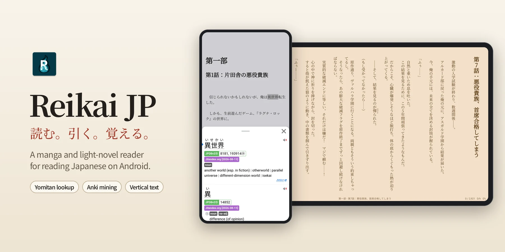
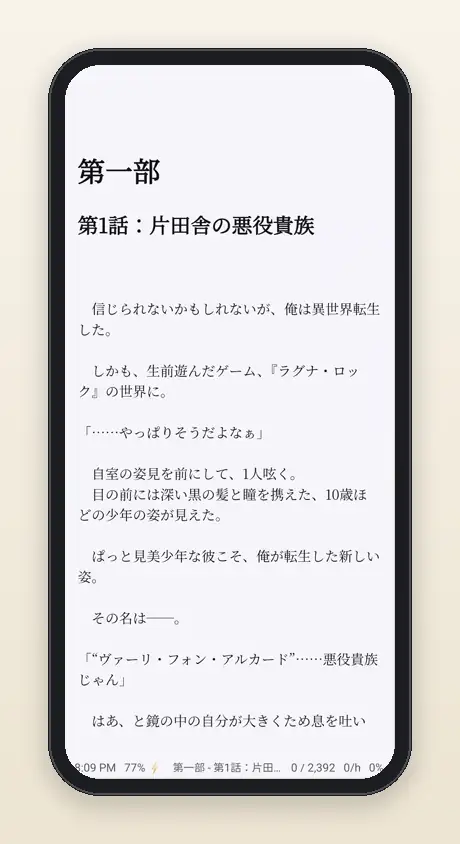
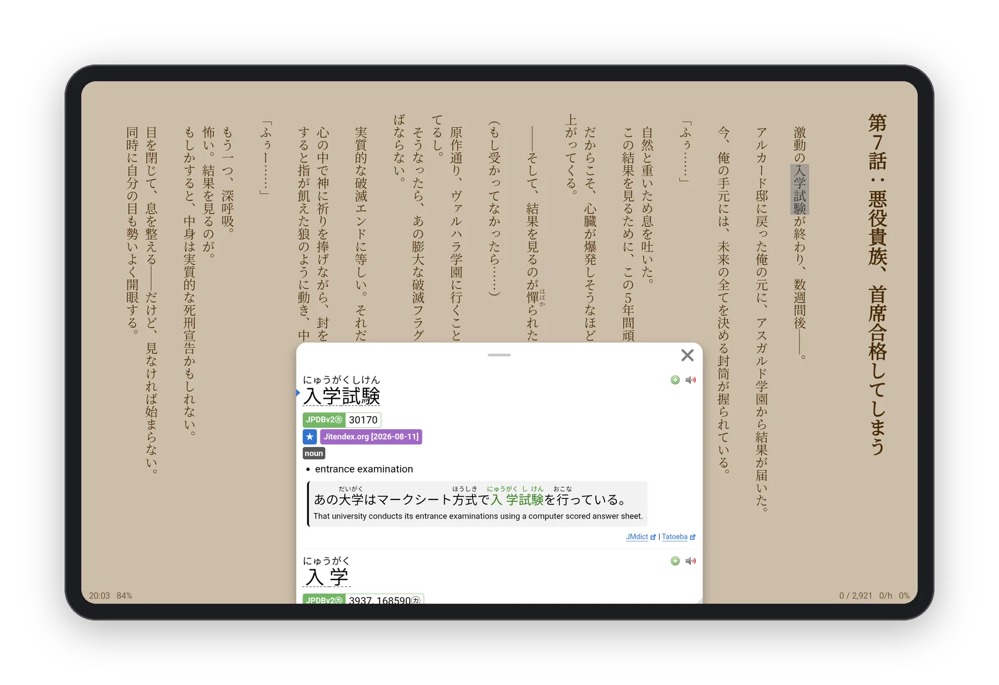
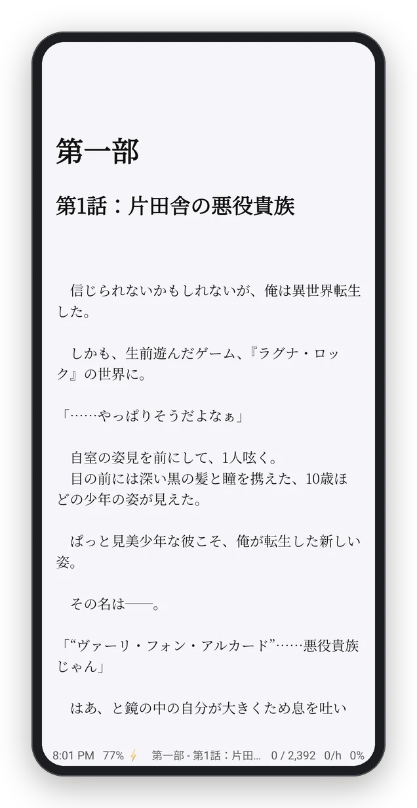
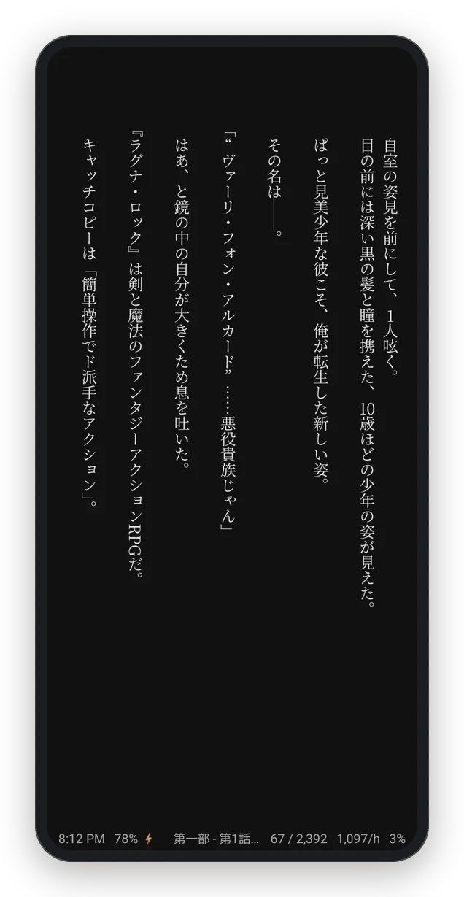
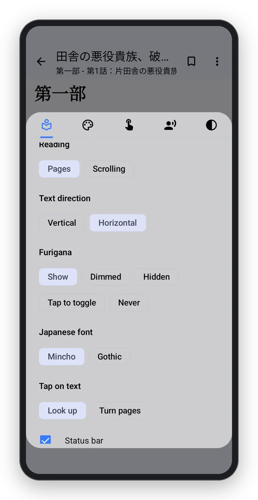
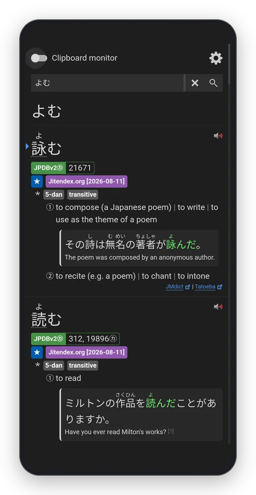
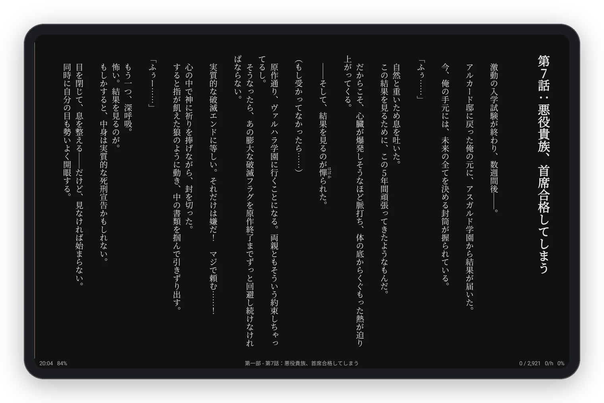
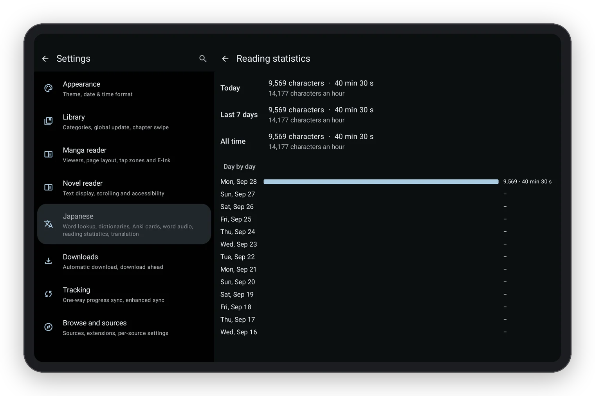

<div align="center">



### Read Japanese manga and light novels on Android, with Yomitan and Anki built in.

Tap any word to look it up, send it to Anki in one tap, and read novels in vertical text the way
they are printed.

[](https://github.com/Zatsuy/Reikai-JP/releases/latest)
[](../docs/fork/install.md)
[](../LICENSE)
[](https://github.com/unseensnick/Reikai)

**[Download](https://github.com/Zatsuy/Reikai-JP/releases/latest)** ·
[Install guide](../docs/fork/install.md) ·
[What's new](../docs/fork/CHANGELOG.md) ·
[Roadmap](../docs/fork/ROADMAP.md)

</div>

## Why Reikai JP

If you learn Japanese by reading, you probably know the desktop setup: Yomitan in the browser for
lookups, Anki for cards, a reader like ttu for books. On a phone or tablet that loop falls apart
into copy, switch app, paste, switch back.

**Reikai JP puts the whole loop into one reader.** Your manga and light-novel library, a reader
made for Japanese text, Yomitan's own dictionary engine running inside the app, and AnkiDroid one
tap away. Nothing to copy, no second app to keep open, and the same dictionaries and card setup you
use on the desktop.

## Tap a word, get Yomitan

<table>
<tr>
<td width="36%" align="center"></td>
<td>

- **It is Yomitan.** Yomitan's own code runs inside the app, unmodified: the same conjugation
  handling, the same results, and every dictionary in Yomitan's format (Jitendex, names, kanji,
  frequency lists, pitch accent). New Yomitan releases arrive on their own.
- **Tap anywhere in a word**, even on its furigana, and the whole word is found. Results appear in
  about a tenth of a second.
- **Hear it**: Yomitan's online audio, your own `android.db` audio collection for offline use, or
  the device's Japanese voice.
- **Coming from the desktop?** Import your Yomitan settings file and keep your setup.
- **Look up from any app**: select Japanese text anywhere on Android and choose *Look up in
  Reikai JP*, or put a Dictionary icon on your home screen.

</td>
</tr>
</table>

## One tap to Anki

<table>
<tr>
<td>

- **Straight into AnkiDroid** through its own interface: no extra app, and it works offline.
- **Set up cards for Lapis** fills the popular [Lapis](https://github.com/donkuri/lapis) note type
  the way its guide says, in one tap. Any other note type works through Yomitan's own card settings.
- **Every card knows where it came from**: the sentence with the word in bold, the book and
  chapter, the cover, and the word's audio. Words already in your deck are flagged before you add
  them.

</td>
<td width="58%" align="center"></td>
</tr>
</table>

## Read it the way it was printed

<div align="center">

</div>

- **Vertical or horizontal text**, turning pages or scrolling continuously. Vertical text scrolls
  sideways, right to left, like the clip above.
- **Furigana your way**: shown, dimmed, hidden until tapped, or off. Mincho, Gothic, or a font you
  add. Proper Japanese line breaking, upright numbers in vertical text, emphasis dots.
- **Your place is kept to the character** when you change the font, the size, the direction or
  rotate the screen.
- **White, sepia, grey, dark or black**, or your own colours.
- **Fast**: a chapter opens in about 0.1 s on a mid-range tablet, twice as fast as the standard
  WebView reader, and page turns are instant.
- **Japanese novels open in it automatically**, never forced: *Switch to standard reader* in the
  menu goes back, and each novel remembers its choice.

<table>
<tr>
<td align="center" width="25%"><br><sub>Horizontal, light</sub></td>
<td align="center" width="25%"><br><sub>Vertical, dark</sub></td>
<td align="center" width="25%"><br><sub>Reader settings</sub></td>
<td align="center" width="25%"><br><sub>Dictionary search</sub></td>
</tr>
</table>

<div align="center">


</div>

## And the rest of a reading habit

- **Reading statistics** counted the way ttu counts them: characters, time and speed per day, with
  an export for ttu. A small status bar shows the clock, battery, chapter progress and your speed.
- **Translate a whole chapter** when you are stuck (Google, or DeepL or an AI service with your own
  key; keys never go into backups).
- **Export downloaded chapters as an EPUB**, for any other reader.
- **Short chapters that fit on one screen** are marked read when you reach them.

## Everything Reikai already does

Reikai JP is a fork of [Reikai](https://github.com/unseensnick/Reikai), which is built on
[Mihon](https://github.com/mihonapp/mihon). Everything it does stays: manga and light novels in one
library, LNReader-format novel plugins and novel extension apps, trackers, categories, backups,
merging a series from several sources, and Mihon's manga reader. Reikai's new work is merged in
every week, automatically.

<div align="center">

<br><sub>Reikai's own screens (from upstream Reikai)</sub>
</div>

## Get started

1. **Install**: download `reikai-jp-arm64-v8a-….apk` from the
   [latest release](https://github.com/Zatsuy/Reikai-JP/releases/latest) and open it
   ([step by step](../docs/fork/install.md)). Android 8.0 or newer. It installs beside Reikai or
   Mihon, and a backup from Reikai brings your library along.
2. **Add your sources** in Browse → Extensions. Like Mihon, Reikai JP ships none.
3. **Get a dictionary**: Settings → Japanese → *Get recommended dictionaries* → Download next to
   Jitendex (a few minutes). A frequency list such as JPDB is a good second.
4. **Connect Anki** (optional): in the same screen, allow AnkiDroid, then *Set up cards for Lapis*
   and pick your deck.
5. **Open a Japanese novel and tap a word.**

Updates install from inside the app: when a new version is out, Reikai JP shows a *New version
available!* screen with one button.

## Coming next

- **A guided first-run setup**: one screen that downloads a dictionary, connects AnkiDroid and shows
  Japanese sources, so a new install is reading and mining in a few minutes.
- **Local books**: open your own EPUB and TXT files in the Japanese reader.
- **Manga lookup**: tap a word in a speech bubble and get the same popup as in novels, with the
  page read on your device (no cloud).
- **Learning extras**: a history of the words you mined with a jump back to the passage, known and
  unknown words coloured from your Anki cards, and sentences with exactly one unknown word.

The full plan, and what is done, is in the [roadmap](../docs/fork/ROADMAP.md).

## Questions

<details>
<summary><b>Is it free?</b></summary>

Yes, and open source under the GPL. No ads, no sign-up, no analytics: the builds leave out
Firebase and every other tracking library.
</details>

<details>
<summary><b>Does it work offline?</b></summary>

Lookups, cards and the reader work offline once your dictionaries are installed. Sources, online
word audio and chapter translation need a connection.
</details>

<details>
<summary><b>Do I have to use the Japanese reader or Yomitan?</b></summary>

No. Any novel can switch back to the standard reader from its menu, and Settings → Japanese → *Look
up words with Yomitan* turns lookup off entirely; while it is off the engine never starts and
costs no memory.
</details>

<details>
<summary><b>Are dictionaries included?</b></summary>

No dictionaries, audio or recognition models are bundled. The app downloads Yomitan's recommended
dictionaries for you, or imports any Yomitan dictionary file you have.
</details>

<details>
<summary><b>Where do I report a problem?</b></summary>

Reikai JP is a personal project kept up by automated checks, so it has no issue tracker. Problems
that also happen in upstream Reikai are best reported [there](https://github.com/unseensnick/Reikai/issues).
</details>

## For developers

<details>
<summary><b>How it fits together</b></summary>

- **`jp-yomitan/`**: Yomitan's release files, vendored unmodified and served from a private address
  inside a WebView, with a stand-in for the browser-extension APIs and Kotlin bridges for AnkiDroid
  and audio. `scripts/fork/yomitan_bump.py` is the only thing that changes them; a weekly
  workflow takes a new Yomitan release once it is a week old and passes a static check and a
  headless-browser smoke test.
- **`app/src/main/java/jp/reikai/`**: the fork's Kotlin (lookup, Anki, the Japanese reader,
  statistics, translation, EPUB export); the reader's page is `app/src/main/assets/jp-reader/`.
- **Upstream files are touched only through small fenced seams** (`// FORK -->` … `// FORK <--`),
  counted by `scripts/fork/seams.py`, so the weekly merge of Reikai stays clean.
- **Automation** (`.github/workflows/fork-*.yml`): CI on every push, the weekly upstream merge, the
  weekly Yomitan update, and a daily signed release when the app changed. Each one applies itself
  when its checks pass and stops quietly when they fail.

Design: [architecture](../docs/fork/architecture.md) · decisions: [decisions](../docs/fork/decisions.md)
· research notes: [research](../docs/fork/research/).
</details>

<details>
<summary><b>Build it</b></summary>

JDK 21 or newer and the Android SDK, then:

```sh
./gradlew assembleDebug        # app/build/outputs/apk/debug/, installs as app.reikai.jp.dev
./gradlew testDebugUnitTest    # unit tests
```

The debug build installs beside the release (`app.reikai.jp`). Builds never include Firebase or
other proprietary SDKs; keep the default `local` distribution profile.
</details>

<details>
<summary><b>How the project is run</b></summary>

Development is done mostly by AI coding agents working from [AGENTS.md](../AGENTS.md), with the
owner deciding direction; the harness they use is described in
[docs/fork/harness.md](../docs/fork/harness.md). Pull requests are not reviewed here. Improvements
that fit Reikai itself are welcome [upstream](https://github.com/unseensnick/Reikai).
</details>

## Credits and licence

Built on [Reikai](https://github.com/unseensnick/Reikai) and [Mihon](https://github.com/mihonapp/mihon),
with [Yomitan](https://github.com/yomidevs/yomitan) as the dictionary engine,
[LNReader](https://github.com/LNReader/lnreader) and its
[plugins](https://github.com/LNReader/lnreader-plugins) for novel sources, and ideas from
[ttu ebook reader](https://github.com/ttu-ttu/ebook-reader), [Tsundoku](https://github.com/tsundoku-otaku/tsundoku)
and the other projects in the [research notes](../docs/fork/research/landscape-2026-09.md).

Reikai JP is distributed under the [GNU GPL v3.0 or later](../LICENSE), which it needs in order to
run Yomitan's code. It includes Apache-2.0 code from Reikai and Mihon, whose licence is kept in
[LICENSES/Apache-2.0.txt](../LICENSES/Apache-2.0.txt); files that came from those projects keep
their original notices. Not affiliated with Reikai, Mihon or Yomitan.

<sub>Screenshots: the novel is 『田舎の悪役貴族、破滅エンドを回避したくて王都の名門学園を首席合格してしまう。』
by 楠木湊人, read on Kakuyomu; definitions from Jitendex and frequencies from JPDB. Taken on a
Galaxy Tab S10 FE and a Galaxy A54.</sub>
